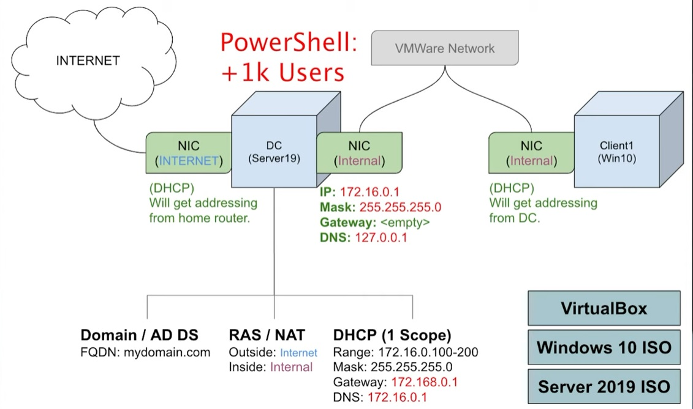

[README.md](https://github.com/user-attachments/files/27150476/README.md)
# How to Setup a Basic Home Lab Running Active Directory (Oracle VirtualBox) | Add Users w/PowerShell

This is a step by step guide on how to set up an Active Directoy home lab based on the training by Josh Madakor. 

## Diagram

## Download and install Oracle VirtualBox from the official website.
[Oracle Virtual Box](https://www.virtualbox.org/)

## Download the Windows 10 and Server 2019 ISO files.
[Windows 10 iso](https://www.microsoft.com/en-us/software-download/windows10ISO)
[Windows Server 2019](https://www.microsoft.com/en-us/evalcenter/evaluate-windows-server-2019)

## Create a new virtual machine by clicking on "New" in VirtualBox, naming it "Domain Controller," and selecting the "Windows Server 2019" ISO file as the boot media.

##  Configure the virtual machine by giving it two network adapters: one for connecting to the internet and the other for the private network.

##  Install Server 2019 on the virtual machine and assign IP addressing for the internal network.

##  Name the server and install Active Directory to create the domain.

##  Configure routing so that clients on the private network can access the internet through the domain controller.

##  Set up DHCP on the domain controller.

##  Run the PowerShell script to create 1000 users in Active Directory.

[Power Shell script for creating users](https://github.com/joshmadakor1/AD_PS)

##  Create a new virtual machine named "Client1" and install Windows 10 on it.

##  Connect the client machine to the private network and join it to the domain.

##  Log into the client machine with a domain account.

